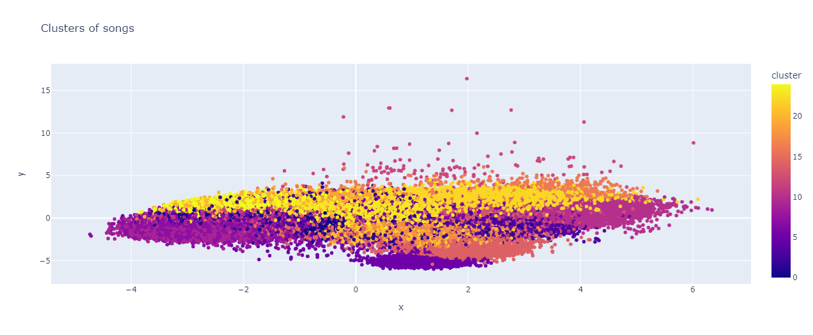
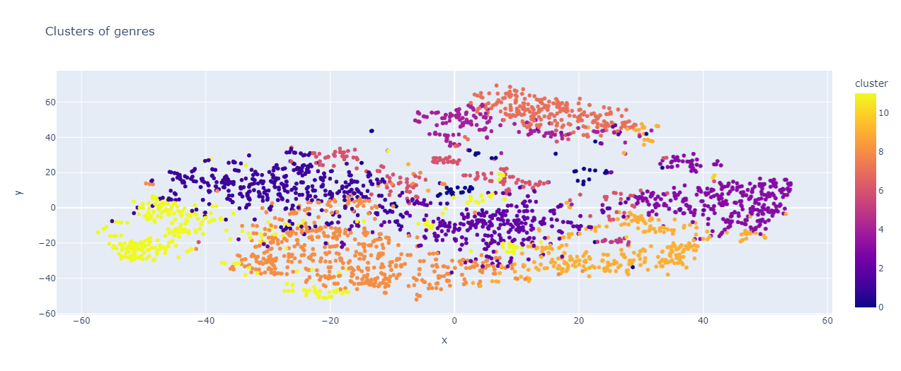

# VibeSync: Emotion-Driven Music Recommendation System


## Table of Contents
- [Overview](#overview)
- [Key Features](#key-features)
- [Technical Implementation](#technical-implementation)
- [Dataset](#dataset)
- [Model Development](#model-development)
- [Evaluation Metrics](#evaluation-metrics)
- [Visualization](#visualization)
- [Real-World Impact](#real-world-impact)
- [Future Scope](#future-scope)
- [Getting Started](#getting-started)
- [Contributing](#contributing)
- [License](#license)

## Overview

VibeSync is an advanced machine learning project developed between March and May 2024. It aims to revolutionize the music listening experience by tailoring recommendations to users' emotional states, effectively syncing songs to moods for a deeply personalized journey through sound.

## Key Features

- **Mood-Centric Approach**: Utilizes advanced algorithms to match music with the user's current emotional state.
- **Personalized Recommendations**: Learns from individual listening patterns to refine suggestions over time.
- **Multi-Lingual Diversity**: Offers a wide range of music across different languages that match the desired vibe.
- **Routine Enhancement**: Designed to improve daily routines and increase work efficiency through mood-appropriate music selection.

## Technical Implementation

### Libraries and Tools
- Data Processing: NumPy, Pandas
- Visualization: Seaborn, Matplotlib, Plotly
- Machine Learning: Scikit-learn
- Natural Language Processing: NLTK, WordCloud
- Music API Integration: Spotipy

### Dataset

The project utilizes the [Spotify Dataset from Kaggle](https://www.kaggle.com/datasets/vatsalmavani/spotify-dataset), which includes a rich collection of song attributes and user listening history.

### Model Development

1. **Data Preprocessing**:
   - Temporal feature handling (year, decade) using Python lambda functions
   - Text data cleaning and normalization for song titles and artist names

2. **Clustering Algorithms**:
   - K-Means Clustering for grouping similar songs
   - Principal Component Analysis (PCA) for dimensionality reduction
   - t-Distributed Stochastic Neighbor Embedding (t-SNE) for high-dimensional data visualization

3. **Recommendation Engine**:
   - Collaborative Filtering: User-based and Item-based
   - Content-Based Filtering: Using song features and lyrics sentiment analysis
   - Hybrid Approach: Combining collaborative and content-based methods

### Evaluation Metrics

- Euclidean Distance
- Cosine Similarity
- Mean Average Precision (MAP)
- Normalized Discounted Cumulative Gain (NDCG)

## Visualization


*Figure 1: Visualization of song clusters using PCA*


*Figure 2: t-SNE visualization of music genres*

## Real-World Impact

- **Enhanced User Experience**: Tailored music recommendations lead to higher user satisfaction and engagement.
- **Industry Insights**: Provides valuable data for music industry professionals, including DJs, singers, and lyricists, to understand trends and shape their careers.
- **Emotional Well-being**: Contributes to users' emotional regulation and mental health through mood-appropriate music selection.

## Future Scope

1. **Custom Tune Creation**: Generate unique music tracks based on user listening patterns and preferences.
2. **Voice-Based Recommendation**: Implement voice analysis to suggest music based on the user's vocal characteristics and emotional state.
3. **Cross-Platform Integration**: Expand the system to work seamlessly across various music streaming platforms.
4. **Real-time Mood Detection**: Integrate wearable technology to detect mood changes and adjust recommendations in real-time.

## Getting Started

```bash
# Clone the repository
git clone https://github.com/Yashmittal4/VibeSync.git

# Install dependencies
pip install -r requirements.txt

# Run the main application
python main.py
```

## Model Prediction

```
recommend_songs([{'name': 'Blinding Lights', 'year': 2019}], data)
- Fetching song information from spotify dataset
[{'name': 'Best News Ever', 'year': 2017, 'artists': "['MercyMe']"},
 {'name': 'Bit By Bit', 'year': 2012, 'artists': "['Mother Mother']"},
 {'name': 'Hotel Ceiling', 'year': 2014, 'artists': "['Rixton']"},
 {'name': 'We Go Together Like', 'year': 2020, 'artists': "['Abby Anderson']"},
 {'name': "Somethin' Bad (with Carrie Underwood) - (Duet with Carrie Underwood)",
  'year': 2014,
  'artists': "['Miranda Lambert', 'Carrie Underwood']"},
 {'name': 'A Different World (feat. Corey Taylor)',
  'year': 2016,
  'artists': "['Korn', 'Corey Taylor']"},
 {'name': 'Sober', 'year': 2015, 'artists': "['Selena Gomez']"},
 {'name': 'Almost Maybes', 'year': 2020, 'artists': "['Jordan Davis']"},
 {'name': "Don't Say Goodnight",
  'year': 2014,
  'artists': "['Hot Chelle Rae']"},
 {'name': 'Sight of the Sun - Single Version',
  'year': 2014,
  'artists': "['fun.']"}]
```

```
recommend_songs([{'name': 'Fix You', 'year':2005}], data)
- Fetching song information from local dataset
[{'name': 'Have I Told You Lately',
  'year': 1989,
  'artists': "['Van Morrison']"},
 {'name': 'Amazing Grace (My Chains Are Gone)',
  'year': 2020,
  'artists': "['Pentatonix']"},
 {'name': 'Fine Line', 'year': 2019, 'artists': "['Harry Styles']"},
 {'name': 'Goodbye', 'year': 1993, 'artists': "['Air Supply']"},
 {'name': 'Thank You For Loving Me', 'year': 2000, 'artists': "['Bon Jovi']"},
 {'name': 'Stop Crying Your Heart Out', 'year': 2002, 'artists': "['Oasis']"},
 {'name': 'Awake My Soul', 'year': 2009, 'artists': "['Mumford & Sons']"},
 {'name': 'Ashes of Eden', 'year': 2015, 'artists': "['Breaking Benjamin']"},
 {'name': 'Go the Distance', 'year': 1997, 'artists': "['Michael Bolton']"}]
```

```
recommend_songs([{'name': 'I Will Follow', 'year':2010},{'name': 'Come As You Are', 'year':1991}],  data)
- Fetching song information from local dataset
[{'name': 'Face Down',
  'year': 2006,
  'artists': "['The Red Jumpsuit Apparatus']"},
 {'name': 'BURN IT DOWN', 'year': 2012, 'artists': "['Linkin Park']"},
 {'name': 'The Last Stand', 'year': 2016, 'artists': "['Sabaton']"},
 {'name': 'In Your Eyes (feat. Kenny G) - Remix',
  'year': 2020,
  'artists': "['The Weeknd', 'Kenny G']"},
 {'name': 'Pray to God (feat. HAIM)',
  'year': 2014,
  'artists': "['Calvin Harris', 'HAIM']"},
 {'name': '空に歌えば', 'year': 2017, 'artists': "['amazarashi']"},
 {'name': 'Stranded', 'year': 2016, 'artists': "['Gojira']"},
 {'name': 'Tequila - R3HAB Remix',
  'year': 2018,
  'artists': "['Dan + Shay', 'R3HAB']"},
 {'name': 'Charlie', 'year': 2006, 'artists': "['Red Hot Chili Peppers']"},
 {'name': 'War of Change',
  'year': 2012,
  'artists': "['Thousand Foot Krutch']"}]
```

## Conclusion

In conclusion, this project aimed to develop a music recommendation system using the listening history of the users and the listening history of other users. The dataset was loaded and explored. The dataset was preprocessed by handling temporal features such as year and decade. The model was developed using the scikit-learn library. Clustering algorithms such as K-Means Clustering, Principal Component Analysis (PCA), and t-Distributed Stochastic Neighbor Embedding (t-SNE) were used to develop the model. The model was evaluated using appropriate metrics such as euclidean distance, spatial distance, and other similarity metrics. The model was able to recommend songs to the users based on their listening history. The model was able to recommend songs to the users based on the name and year of the song.


## References

- Scikit-learn Documentation: https://scikit-learn.org/stable/modules/clustering.html
- Dimensionality Reduction: https://scikit-learn.org/stable/modules/decomposition.html
- Scipy Documentation: https://docs.scipy.org/doc/scipy/reference/
- Plotly Documentation: https://plotly.com/python/
- Spotipy Documentation: https://spotipy.readthedocs.io/en/2.22.1/
